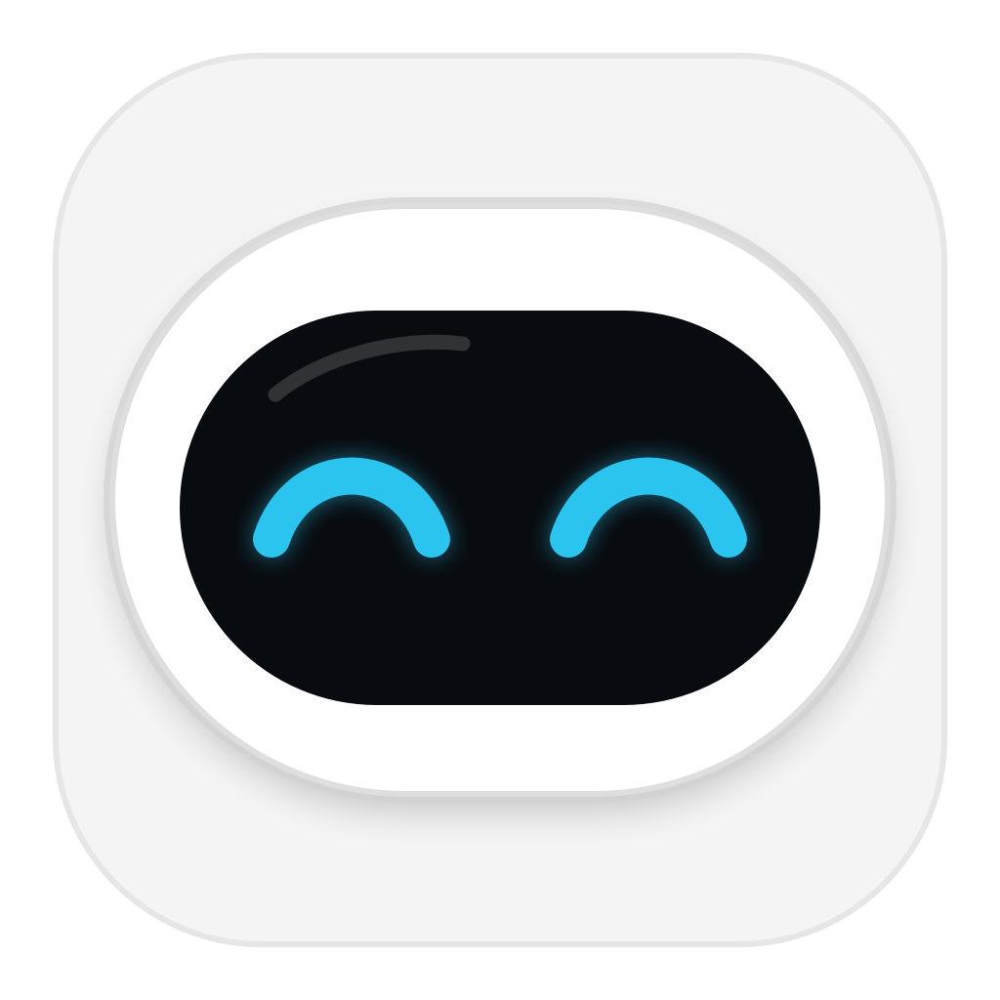
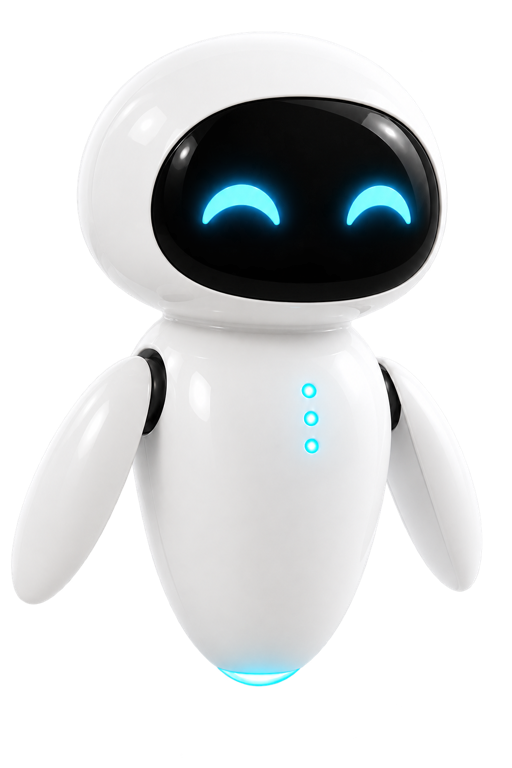

# 伊娃桌面宠物 · Mac 2.0

<p align="center">
  
</p>

<p align="center">
  一位温暖、轻量、会回应你的原生 macOS 桌面机器人伙伴。
</p>

<p align="center">
  <a href="https://github.com/wangkaikaise/Eva-Desktop-Pet/releases/latest"></a>
  
  <a href="LICENSE"></a>
</p>

伊娃悬浮在桌面上，以舒缓连贯的动作陪伴你。她会回应点击与拖动、在不同心情之间自然切换、提醒你喝水和休息，也能用可自由摆放的玻璃卡片显示电脑状态。Mac 2.0 重点完成了角色动作体系、火箭玩耍、跟手拖动和原生菜单栏体验。

> [下载最新版 Mac 2.0](https://github.com/wangkaikaise/Eva-Desktop-Pet/releases/latest) · 下载 ZIP、解压后将应用拖入“应用程序”文件夹。

## Mac 2.0 核心功能

### 温暖的桌面伙伴

- 白色一体机身、黑色面屏、蓝色发光眼睛，保持简洁三色视觉
- 待机、巡航、开心、玩耍、休眠五种长周期连续动画
- 每种动作都有对应眼神、胸前柔光、身体姿态和自然过渡
- 开心、平静、疲惫、烦躁、低落、专注六种打工人情绪
- 情绪可手动选择，也可每 15、30 或 60 分钟自动切换

### 互动与玩耍

- 点击伊娃会随机进入一种不同状态，而不是重复固定动作
- 拖动窗口时紧跟指针，并根据上下左右方向改变姿态、尾迹和阴影
- 玩耍时变成白色小火箭，沿“8”字路线飞行；火箭状态也可以直接拖动
- 休眠时显示更醒目的玻璃月亮与 `Zzz` 提示
- 右键快速选择动作；菜单栏伊娃头像可显示、隐藏和打开设置

### 玻璃光效与个性化

- 无实体底座的透明玻璃光池，亮度可调
- 柔光环、安心泡泡、守护轨道三种玻璃防护罩
- 可调整角色尺寸、整体透明度、动作速度和窗口置顶状态
- 菜单栏采用伊娃模板头像，自动适配 macOS 浅色、深色和选中状态

### 电脑状态卡片

- 显示 CPU 占用率、CPU 热状态、GPU 占用率和可用的 GPU 温度状态
- 卡片可固定在伊娃上、下、左、右四个标准位置，避免遮挡角色
- 玻璃背景和整体内容透明度可调，背景支持完全透明
- 可更换圆体、系统、等宽字体以及白色、蓝色、黑色文字
- 支持 2、5、10 秒刷新间隔，关闭后停止采样以降低资源占用

### 提醒、性能与隐私

- 支持每日定时及每 15–120 分钟重复的喝水、活动、护眼和待办提醒
- 20–30 FPS 自适应渲染，静态状态降低刷新率，资源图片按需缓存
- 可选登录后自动启动
- 偏好、提醒和性能数据全部保存在本机，不上传任何个人数据

## 形象与界面

| 伊娃标准形象 | 应用与菜单栏头像 |
| --- | --- |
|  |  |

角色本体统一使用白色机身、黑色面屏和蓝色眼睛；底部光池、防护罩和状态卡片使用同一套透明玻璃语言。菜单栏头像为单色矢量模板，会跟随系统外观自动变色。

## 环境

- macOS 13 或更高版本
- Xcode 16+（仅运行可使用 Swift 6 命令行工具；测试需要 Xcode 提供的 XCTest）

## 开发运行

```bash
swift run EvaDesktopPet
```

也可以在 Xcode 中选择 `File > Open`，直接打开仓库目录下的 `Package.swift`。

## 测试

```bash
swift test
```

## 打包为 `.app`

```bash
chmod +x scripts/build-app.sh
./scripts/build-app.sh
open "dist/Eva Desktop Pet.app"
```

脚本会执行 release 构建、组装应用包，并使用本机 ad-hoc 签名。若要公开分发，应使用 Apple Developer ID 签名并完成 notarization。

## 使用

1. 启动后，伊娃会出现在主屏幕右下角。
2. 拖动机器人可改变位置；点击会触发回应。
3. 右键机器人可切换动作。
4. 点击菜单栏的伊娃头像可显示、隐藏宠物，切换动作或打开设置。
5. 首次添加提醒时允许通知权限。

设置窗口的“动作预览”可以直接切换五种状态；在宠物上点击右键也可以切换。

## 视觉资产

白色悬浮机器人视觉为本项目原创 AI 生成资产，采用一体胶囊机身、黑色面屏和蓝色弧形眼睛，并避免复刻影视角色的精确设计细节。代码使用 MIT License；视觉资产仅随本项目使用和再分发。

## Mac 2.0

Mac 2.0 完成伊娃动作与互动体验的整体升级：点击随机切换状态；玩耍时变为三色小火箭沿连续轨迹飞行，并可保持火箭形态顺畅拖动；尾焰、阴影与朝向实时跟随拖动方向。性能卡片支持四向固定锚点和完全透明背景，休眠提示更醒目，菜单栏也换成自动适配系统外观的伊娃头像。

## v1.1.0

这是 macOS 版的小版本精修：重绘三色一体化形象与图标，移除耳部、颈部金属件和实体底座；统一为透明玻璃光效；放慢动作和表情切换；增加性能卡片外观设置与间隔提醒。

## v1.1.1

修复开心动作造型跳变：所有常规与开心动作共享同一标准角色骨架。胸前改为单个动态核心，并随待机、巡航、开心、睡眠和拖动切换色彩。新增方向感知拖动奔跑反馈、完全透明性能信息背景，以及扫描弧、刻度节点和分层轨道组成的新科技防护罩。

## v1.1.2

重构动作体系：所有状态只使用同一张标准角色骨架，从源头消除休眠状态的胸口偏移、残留光点和风格割裂。巡航升级为带柔和尾迹的慢速水平飞行；拖动采用鼠标目标位置与 60 FPS 插值跟随；点击新增暖心玩耍动作。核心始终锁定胸部中轴，颜色改为低饱和柔光并在动作间缓慢过渡。

## v1.1.3

为五种动作加入独立动态眼睛：待机柔和弧眼、巡航专注眼、开心弯眼、玩耍高光圆眼和休眠闭眼。性能卡片移动到更宽的右侧安全区，即使宠物以最小尺寸巡航到右侧，也不会遮挡头部。

## v1.1.4

拖动改为窗口与鼠标同步移动，移除会产生滞后的追赶插值；五种动作升级为更明显、更拟人的悬浮、巡航、跳跃、玩耍和呼吸节奏，并采用最高 30 FPS 的自适应渲染。性能卡片新增上、下、左、右位置选择和整体透明度调节，所有面向用户的伙伴名称统一为“伊娃”。

## v1.1.6

- 修复玩耍火箭状态下透明区域导致鼠标拖动事件穿透的问题
- 菜单栏图标更新为简约伊娃头像，并自动适配 macOS 浅色、深色与选中状态

## v1.1.5

重新设计玩耍动作：伊娃会平滑变身为白色小火箭，沿连续的“8”字曲线来回飞行，再自然恢复伙伴形态。小火箭延续白色机身、黑色舷窗和蓝色眼睛/推进光效的三色规范，玩耍时仍可拖动，并会按拖动方向转向推进、延伸尾气和留下柔光残影。点击伊娃会从当前状态之外随机选择一种动作，不再固定进入玩耍；性能卡片采用以角色为基准的四向固定锚点，上方对齐头顶、下方避开底部光效、左右对齐头胸区域；休眠状态使用更醒目的玻璃月亮与 Zzz 提示。

## macOS 性能数据说明

CPU 占用率来自公开的 Mach 主机统计接口。GPU 占用率会读取当前机型可用的 IORegistry 性能统计，部分旧机型可能不提供。macOS 没有向普通第三方应用开放统一、公开的 CPU/GPU 摄氏温度 API，因此应用会显示 Apple 提供的系统热状态，并对无法取得的 GPU 温度明确标记为“系统限制”，不会猜测或伪造温度。

## 版本路线

- `Mac 2.x`：继续打磨 macOS 桌面伙伴的动作、提醒、性能与稳定性。
- 下一阶段：抽离共享数据模型与角色资产规范，准备 Windows 桌面版与手机 App。
